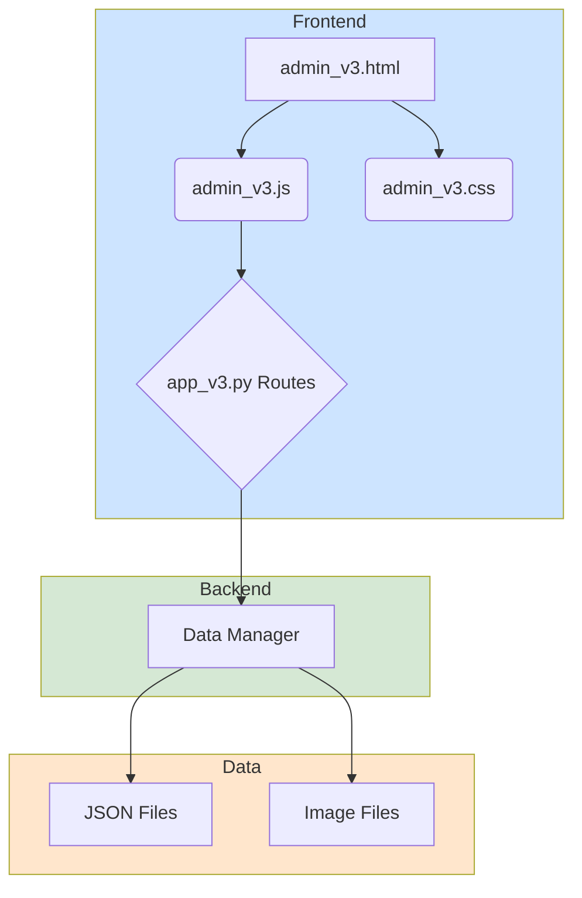

# Admin V3 - System Architecture

**Version:** 3.0.0-alpha  
**Status:** In Development

## Overview

Admin V3 follows a clean, modular architecture designed for maintainability, scalability, and a clear separation of concerns. The system is divided into three main layers: Backend (Flask), Frontend (HTML/CSS/JS), and Data (JSON files).

## Architecture Diagram

## Components

### Backend (Flask)

-   **`app_v3.py`:** The main application entry point. Initializes the Flask app, loads configurations, and registers blueprints. All application logic is delegated to other modules.
-   **`routes/admin_v3.py`:** A Flask blueprint containing all routes related to the V3 admin dashboard (e.g., `/admin_v3`, `/api/v3/images`, `/api/v3/categories`).
-   **`data_manager_v3.py`:** A dedicated module for all data persistence operations. It handles reading from and writing to the JSON data files, providing a clean and consistent API for data access. This isolates the application logic from the specifics of the data storage.

### Frontend (Static Files)

-   **`templates/admin_v3.html`:** A single, clean HTML template for the admin dashboard. It contains the structure of the page but no inline styles or scripts.
-   **`static/css/admin_v3.css`:** A single, well-organized CSS file containing all styles for the V3 admin dashboard.
-   **`static/js/admin_v3.js`:** A single JavaScript file containing all client-side logic for the V3 admin dashboard. It is organized into modules for UI manipulation, API communication, and event handling.

### Data Layer

-   **`/data/*.json`:** A set of JSON files used for data persistence. This includes image metadata, category assignments, and application settings. The `data_manager_v3.py` module is the sole interface to this data.
-   **`/data/images/`:** The directory where all uploaded image files are stored.

## Data Flow

### Reading Data (e.g., Loading Images)
1.  The user loads the `/admin_v3` page.
2.  `admin_v3.js` makes an API call to `/api/v3/images`.
3.  The `routes/admin_v3.py` blueprint receives the request.
4.  The route calls a function in `data_manager_v3.py` to get the image data.
5.  `data_manager_v3.py` reads the relevant JSON files and returns the data.
6.  The route sends the data back to the frontend as a JSON response.
7.  `admin_v3.js` receives the data and dynamically renders the image gallery.

### Writing Data (e.g., Updating a Category)
1.  The user updates an image's categories in the UI.
2.  `admin_v3.js` sends a `POST` request to `/api/v3/images/<filename>` with the new data.
3.  The `routes/admin_v3.py` blueprint receives the request.
4.  The route calls a function in `data_manager_v3.py` to update the image's categories.
5.  `data_manager_v3.py` reads the `image_categories.json` file, updates the data, and writes it back to the file.
6.  The route returns a success response.
7.  `admin_v3.js` updates the UI to reflect the change.

This architecture ensures that the system is easy to understand, maintain, and extend. By enforcing a strict separation of concerns, we can modify one part of the system (e.g., the UI) with minimal impact on other parts (e.g., the data storage).

